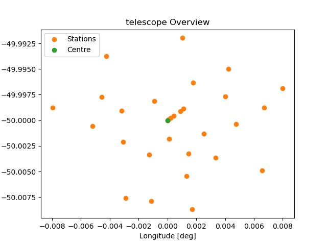

# Examples

## Running an interferometer simulation

Running an interferometer simulation is really easy.
Please look at the karabo.package documentation for specifics on the individual functions.

```python
<example_interfe_simu.py>
```

## Show telescope config

```python
<example_tel_set.py>
```



## Use Karabo on a SLURM cluster

Karabo makes all the nodes available to the user with the help of Dask. The `DaskHandler` class manages the creation of a Dask client and provides a simple interface to interact with it. The class has some static variables that can be modified to change the behavior of the Dask client. The user does not need to interact with Dask directly, as everything happens in the background and is managed by Karabo. However, here is an example of how to use the Dask client directly.

```python
from karabo.dask import DaskHandler

# Get the Dask client
client = DaskHandler.get_dask_client()

# Use the client as needed
result = client.submit(my_function, my_argument)
```

In this example, we set the number of workers on the scheduler node to 1, the number of threads per worker to 1, and the minimum RAM per worker to 2 GB. Then, we get the Dask client using the get_dask_client method of DaskHandler and use it to submit a function with an argument. The my_function function will be executed on one of the available workers in the cluster.

Note that you can also update the static variables and adapt them to different needs. For example, if you have a large dataset that requires more RAM, you can increase the value of min_ram_per_worker accordingly.

```python
from karabo.dask import DaskHandler
# Modify the static variables
DaskHandler.min_ram_per_worker = 4.0

# Get the Dask client
client = DaskHandler.get_dask_client()

# Use the client as needed
result = client.submit(my_function, my_argument)
```

You can also change the requirements of the Dask client between two calls to get_dask_client. For example, if you want to use more workers for a specific task, you can do the following:

```python
from karabo.dask import DaskHandler
# Modify the static variables
DaskHandler.min_ram_per_worker = 4.0

# Run something
client = DaskHandler.get_dask_client()
result = client.submit(my_function, my_argument)

# Run something else
client = DaskHandler.get_dask_client()
result = client.submit(my_function, my_argument)
```

DaskHandler manages the dask workers and dask scheduler in the background, the user is not required to interact with them directly and restart the workers or scheduler manually.

At the beginning of the script, the dask usage can also be overwritten globally as follows:

```python
from karabo.dask import DaskHandler
# Modify the static variables
DaskHandler.use_dask = False
```
