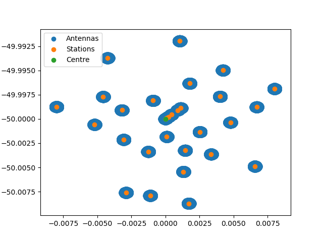

# Examples

## Running a general interferometer simulation

The following example showcases a simple telescope simulation using the main pipeline ingredients.

```python
from datetime import datetime

import numpy as np

from karabo.simulation.interferometer import InterferometerSimulation
from karabo.simulation.observation import Observation
from karabo.simulation.sky_model import SkyModel
from karabo.simulation.telescope import Telescope

# create a simple sky model with three point sources
sky = SkyModel()
sky_data = np.array(
    [
        [20.0, -30.0, 1, 0, 0, 0, 100.0e6, -0.7, 0.0, 0, 0, 0],
        [20.0, -30.5, 3, 2, 2, 0, 100.0e6, -0.7, 0.0, 600, 50, 45],
        [20.5, -30.5, 3, 0, 0, 2, 100.0e6, -0.7, 0.0, 700, 10, -10],
    ]
)
sky.add_point_sources(sky_data)

# get different predefined telescopes,
# like here the OSKAR example telescope.png, with a handy functions
telescope = Telescope.constructor("EXAMPLE")

# overwrite or set any of the implemented configuration values
telescope.centre_longitude = 3
simulation = InterferometerSimulation()

# create new observational settings with most settings set to default
# except the start frequency set to 1e6
observation = Observation(
    start_frequency_hz=1e6,
    start_date_and_time=datetime(2024, 3, 15, 10, 46, 0),
)

# run a single simulation with the provided configuration
simulation.run_simulation(telescope, sky, observation)
```

## Show telescope config

```python
from karabo.simulation.telescope import Telescope

telescope = Telescope.constructor("EXAMPLE")
telescope.plot_telescope(file="example_telescope.png")
```

## Imaging

The notebook [imaging.ipynb](https://github.com/i4Ds/Karabo-Pipeline/blob/main/karabo/examples/imaging.ipynb), shows how to use different dirty imaging and image cleaning algorithms.

## Source detection

In the example notebook [source_detection.ipynb](https://github.com/i4Ds/Karabo-Pipeline/blob/main/karabo/examples/source_detection.ipynb), we simulate data, perform dirty imaging, clean the image, and then run and evaluate a source detection algorithm.

## SRCNet

Karabo is used in the SRCNet to generate simulated test data resembling SKAO data.

The script [SRCNet_v0.1_simulation_1_MeerKAT.py](https://github.com/i4Ds/Karabo-Pipeline/blob/main/karabo/examples/SRCNet_v0.1_simulation_1_MeerKAT.py) generates simulated visibilities and a dirty image for the SRCNet v0.1 release using the MeerKAT SKA-MID precursor telescope.  
Data volume generated: 43 GB.  
Required hardware: 32 GB RAM, 64 GB storage.  
Approximate runtime with 16 cores, no GPU: 1 day.  
Suggested command due to the runtime and due to Karabo currently logging to STDOUT: `nohup python SRCNet_v0.1_simulation_1_MeerKAT.py > karabo_log.txt &`  
By default, Karabo will use /tmp as the root dir for output and the data is written to a directory created by Karabo below this root dir. If the SCRATCH env var is set, Karabo will use the directory defined there as the root dir instead. If the TMPDIR or TMP env var is set, Karabo will use the directory defined there as the root dir instead. The precedence is TMPDIR = TMP > SCRATCH > /tmp.

The script [SRCNet_v0.1_simulation_2_AAstar.py](https://github.com/i4Ds/Karabo-Pipeline/blob/main/karabo/examples/SRCNet_v0.1_simulation_2_AAstar.py) generates simulated visibilities, a dirty image and a cleaned image for the SRCNet v0.1 release using the SKA-MID AA\* layout.  
Data volume generated: 3 TB.  
Required hardware: 64 GB RAM, > 3 TB storage.  
Approximate runtime with 12 cores, NVIDIA Tesla P100 16 GB GPU: 31 h (visibilities 14 h, dirty imaging 3.5 h, image cleaning 13.5 h).  
Running on GPU currently only speeds up the simulation part, not the imaging part. For the simulation part, we observed a massive speed-up (factor 18) when using the GPU (InterferometerSimulation parameter use_gpus).  
See paragraph above for log capture and output directory suggestions.  

The notebook [SRCNet_simulation_walkthrough.ipynb](https://github.com/i4Ds/Karabo-Pipeline/blob/main/karabo/examples/SRCNet_simulation_walkthrough.ipynb) contains a small example based on `SRCNet_v0.1_simulation_1_MeerKAT.py` that can be run on a laptop in a couple of minutes. It walks you through the whole process, from loading the survey / sky model and configuring the telescope, to configuring observation parameters and setting up and running the simulation, to creating a dirty image from the generated visibilities.

In addition, we provide utility to create SRCNet Rucio metadata for the ingestion daemon for `images` and `visibilities` data products. The script [SRCNet_rucio_meta.py](https://github.com/i4Ds/Karabo-Pipeline/blob/main/karabo/examples/SRCNet_rucio_meta.py) provides an example of how to generate metadata for a small simulation and imaging pipeline.

## Performing a line emission simulation, using both OSKAR and RASCIL

See the script [line_emission.py](https://github.com/i4Ds/Karabo-Pipeline/blob/main/karabo/simulation/line_emission.py) and the notebook [LineEmissionBackendsComparison.ipynb](https://github.com/i4Ds/Karabo-Pipeline/blob/main/karabo/examples/LineEmissionBackendsComparison.ipynb) for an end-to-end line emission simulation.

This simulation begins with a `SkyModel` instance, and with the definition of the desired `Observation` and `Telescope` details. Then, the `InterferometerSimulation` instance uses the requested backend (OSKAR and RASCIL are currently supported) to compute the corresponding visibilities, and the desired `DirtyImager` instance is used to convert the visibilities into dirty images. Optionally, we can include primary beam effects and correct for such effects in the final dirty images. Finally, we can mosaic different dirty images into one larger image using the `ImageMosaicker` class.




## Notes on the OSKAR Telescope data conventions

Karabo supports many telescope configurations, and uses the OSKAR specification for its telescope directory structure, which is explained below in more detail.

The name of the directory is given the name of the telescope followed by configuration or cycle specification e.g. for VLA configuration C will be “vla.c.tm” and for ALMA cycle 4.2, the name is “alma.cycle4.2”. The  top-level directory must contain a special file to specify the telescope centre position (position.txt), a special file to specify the position of each station (layout.txt), and a set of sub-directories one for every station. Each of these sub-directories contains one or more special files to specify the configuration of that station. For telescope with dishes, it contain just a number.

More details can be find in the OSKAR documentation and source code: https://ska-telescope.gitlab.io/sim/oskar/telescope_model/telescope_model.html

## Using our Demo Installation
We offer an always up-to-date demo installation for Karabo on Renkulab. This demo was created for a workshop at Swiss SKA Days in September 2024. It can be found here:

[SwissSKADays-Karabo-Workshop](https://renkulab.io/projects/menkalinan56/swissskadays-karabo-workshop)

You do not need an account to use the demo. Just hit the green 'Start' button in the top right corner. However, if you want to save your work you need to log in using your GitHub account, your ORCID id, or your edu-ID. Then fork the project. Now changes you make will be saved to your GitLab repository linked to your Renkulab accout.

The free server on Renkulab has limited resources. You will not be able to run much larger simulations than those provided in the demo notebooks. 

A good starting point may be the slide deck of the workshop. You can find it in the folder documents. The code in the slides is available as Jupyter notebooks in the folder notebooks. Those help you get started.
